<h1 align="center">FlexibleBottomSheet</h1></br>

<p align="center">
  <a href="https://opensource.org/licenses/Apache-2.0"></a>
  <a href="https://android-arsenal.com/api?level=21"></a>
  <a href="https://github.com/skydoves/FlexibleBottomSheet/actions/workflows/android.yml"></a>
  <a href="https://androidweekly.net/issues/issue-599"></a>
  <a href="https://github.com/skydoves"></a>
</p><br>

<p align="center">
🐬 FlexibleBottomSheet is an advanced Compose Multiplatform bottom sheet for segmented sizing, non-modal type, and allows interaction behind the bottom sheet similar to Google Maps. It also offers additional conveniences, including specifying sheet sizes, monitoring sheet states, and more customization.
</p><br>

<p align="center">
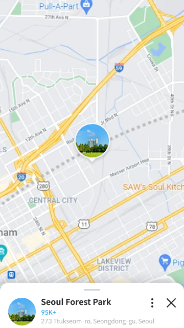
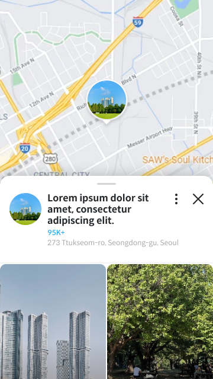
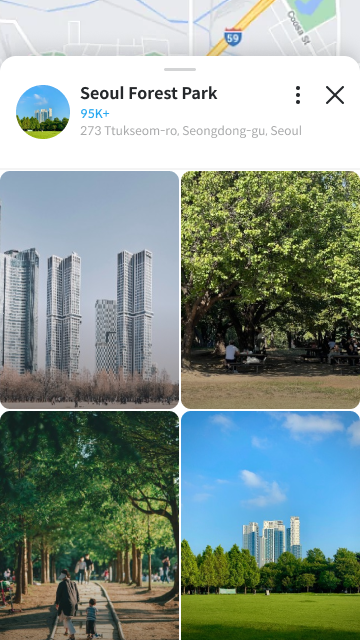
</p>

## Download
[](https://search.maven.org/search?q=g:%22com.github.skydoves%22%20AND%20a:%22flexible-core%22)

### Gradle

Add the dependency below to your **module**'s `build.gradle` file:

```gradle
dependencies {
    // compose material
    implementation("com.github.skydoves:flexible-bottomsheet-material:0.1.5")

    // compose material3
    implementation("com.github.skydoves:flexible-bottomsheet-material3:0.1.5")
}
```

For Kotlin Multiplatform, add the dependency below to your **module**'s `build.gradle.kts` file:

```gradle
sourceSets {
    val commonMain by getting {
        dependencies {
            // compose material
            implementation("com.github.skydoves:flexible-bottomsheet-material:$version")
            
            // compose material3
            implementation("com.github.skydoves:flexible-bottomsheet-material3:$version")
        }
    }
}
```

## Usage

You can implement a flexible bottom sheet with `FlexibleBottomSheet`, similar to the `ModalBottomSheet` provided by [Compose Material 3](https://developer.android.com/jetpack/androidx/releases/compose-material3). Essentially, you can achieve the same behavior as `ModalBottomSheet` by not altering any properties.

### FlexibleBottomSheet

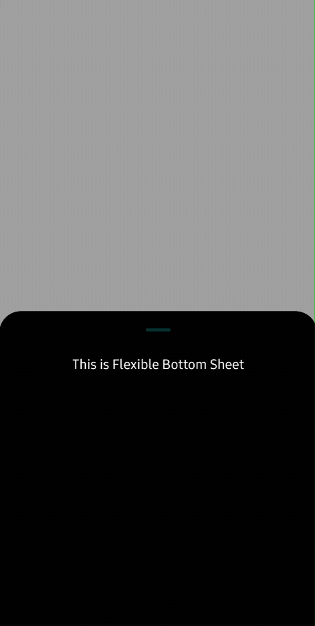

This is a basic example of the `FlexibleBottomSheet`, which is modal, allowing customized sheet sizes for each expanded status, and offers three different expanded statuses (fully, intermediately, slightly):

```kotlin
FlexibleBottomSheet(
  onDismissRequest = onDismissRequest,
  sheetState = rememberFlexibleBottomSheetState(
    flexibleSheetSize = FlexibleSheetSize(
      fullyExpanded = 0.9f,
      intermediatelyExpanded = 0.5f,
      slightlyExpanded = 0.15f,
    ),
    isModal = true,
    skipSlightlyExpanded = false,
  ),
  containerColor = Color.Black,
) {
  Text(
    modifier = Modifier
      .fillMaxWidth()
      .padding(8.dp),
    text = "This is Flexible Bottom Sheet",
    textAlign = TextAlign.Center,
    color = Color.White,
  )
}
```

### FlexibleBottomSheetState

`FlexibleBottomSheetState` is a crucial concept that must be bound to `FlexibleBottomSheet` to manage its state changes. It also enables you to customize UI/UX behaviors for the bottom sheet and take manual control over expanding/hiding the bottom sheet. You can remember the `FlexibleBottomSheetState` by using `rememberFlexibleBottomSheetState` as demonstrated in the example below:

```kotlin
FlexibleBottomSheet(
  onDismissRequest = onDismissRequest,
  sheetState = rememberFlexibleBottomSheetState(
    skipSlightlyExpanded = false,
    skipIntermediatelyExpanded = false,
    isModal = true,
    containSystemBars = false,
    allowNestedScroll = true,
    flexibleSheetSize = FlexibleSheetSize(
      fullyExpanded = 1.0f,
      intermediatelyExpanded = 0.5f,
      slightlyExpanded = 0.25f
    )
  ),
) {
  ..
}
```

You can expand or hide the bottom sheet manually by utilizing the `FlexibleBottomSheetState` like the code below:

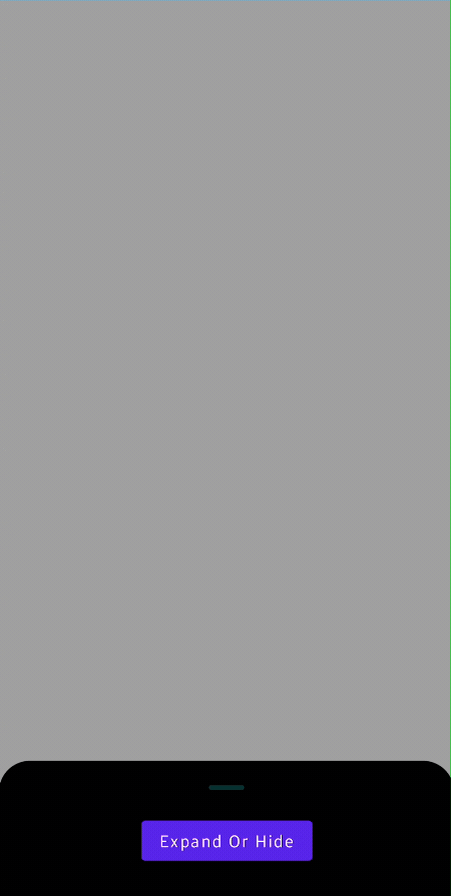

```kotlin
val scope = rememberCoroutineScope()
val sheetState = rememberFlexibleBottomSheetState(
  flexibleSheetSize = FlexibleSheetSize(fullyExpanded = 0.9f),
  isModal = true,
  skipSlightlyExpanded = false,
)

FlexibleBottomSheet(
  sheetState = sheetState,
  containerColor = Color.Black,
  onDismissRequest = onDismissRequest
) {
  Button(
    modifier = Modifier.align(Alignment.CenterHorizontally),
    onClick = {
      scope.launch {
        when (sheetState.swipeableState.currentValue) {
          FlexibleSheetValue.SlightlyExpanded -> sheetState.intermediatelyExpand()
          FlexibleSheetValue.IntermediatelyExpanded -> sheetState.fullyExpand()
          else -> sheetState.hide()
        }
      }
    },
  ) {
    Text(text = "Expand Or Hide")
  }
}
```

### BottomSheet Expanded Status

The flexible bottom sheet offers four primary sheet statuses known as `FlexibleValues`:

- **Fully Expanded**: The sheet is visible at its fully-expanded height. This is mandatory and cannot be skipped.
- **Intermediately Expanded**: The sheet is visible at an intermediate expanded height. This can be skipped by setting `skipIntermediatelyExpanded` to `true`.
- **Slightly Expanded**: The sheet is visible at a slightly expanded height. This is skipped by default but can be enabled by setting `skipSlightlyExpanded` to `false`.
- **Hidden**: The sheet is completely not visible on the screen. If you never want to dismiss and keep displaying the bottom sheet, you can give `skipHiddenState` to `true`.

You have the option to skip the **Intermediately Expanded** and **Slightly Expanded** states, as demonstrated below:

```kotlin
FlexibleBottomSheet(
  onDismissRequest = onDismissRequest,
  sheetState = rememberFlexibleBottomSheetState(
    skipSlightlyExpanded = false,
    skipIntermediatelyExpanded = false
  ),
) {
  ..
}
```

### Expanded Sizes

**FlexibleBottomSheet** offers you to customize the expanded size the content size of bottom sheet based on its states. These constraints are calculated by multiplying the ratio with the maximum display height excluding the systembars (status and navigation bars). You can simply customize the expanded sheet size by setting `FlexibleSheetSize` to the `rememberFlexibleBottomSheetState` like the code below:

```kotlin
FlexibleBottomSheet(
  onDismissRequest = onDismissRequest,
  sheetState = rememberFlexibleBottomSheetState(
    flexibleSheetSize = FlexibleSheetSize(
      fullyExpanded = 0.85f,
      intermediatelyExpanded = 0.45f,
      slightlyExpanded = 0.15f,
    ),
  )
) {
  ..
}
```

Fully (0.85) | Intermediately (0.45) | Slightly (0.15) |
| :---------------: | :---------------: | :---------------: |
| 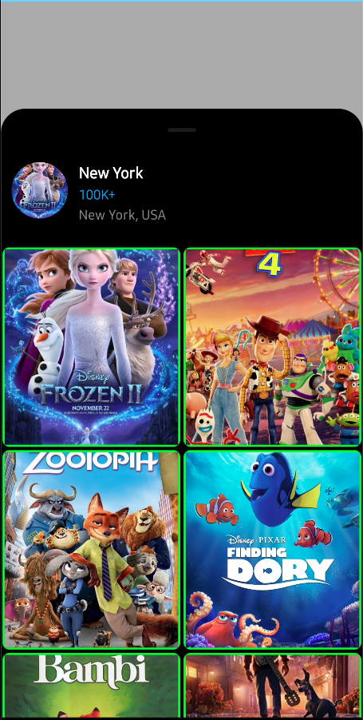 | 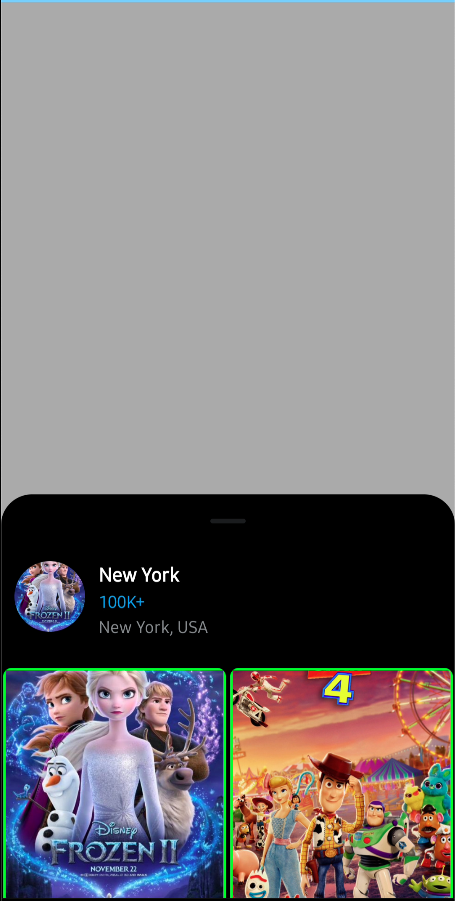 | 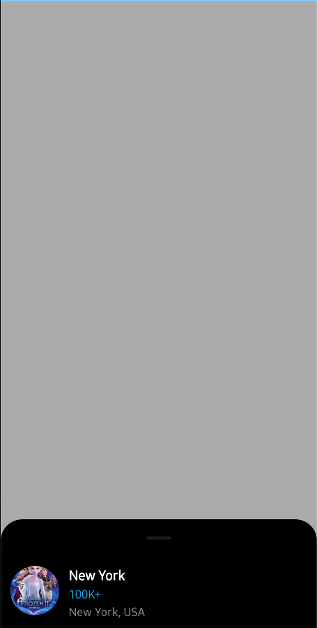 |

### Non-Modal BottomSheet

<p align="center">


</p>

If you need to interact outside of the bottom sheet while the sheet is displayed on the screen, similar to the Google Maps style, you can easily achieve this by setting the `isModal` as **false** property for the `FlexibleBottomSheet` composable, as shown below:

```kotlin
FlexibleBottomSheet(
  onDismissRequest = onDismissRequest,
  sheetState = rememberFlexibleBottomSheetState(
    isModal = false,
    skipSlightlyExpanded = false,
  ),
) {
  ..
}
```

You will see the result below:

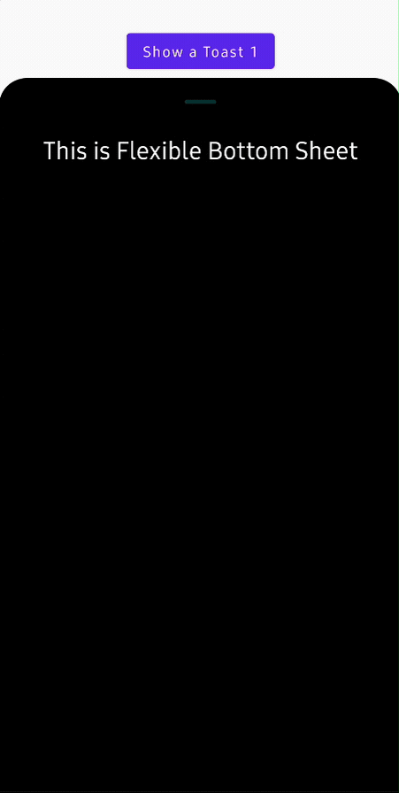

### Dynamic Content By Monitoring Value Changes

You can dynamically compose your bottom sheet content by tracking the bottom sheet state changes. The sample code below demonstrates how you can easily observe the sheet state and adjust the text size accordingly:

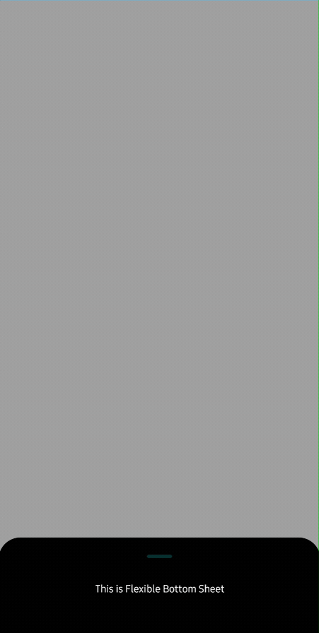

```kotlin
var currentSheetTarget by remember { 
  mutableStateOf(FlexibleSheetValue.IntermediatelyExpanded) 
}

FlexibleBottomSheet(
  onDismissRequest = onDismissRequest,
  sheetState = rememberFlexibleBottomSheetState(
    skipSlightlyExpanded = false
  ),
  onTargetChanges = { sheetValue ->
    currentSheetTarget = sheetValue
  },
  containerColor = Color.Black,
) {
  Text(
    modifier = Modifier
      .fillMaxWidth()
      .padding(8.dp),
    text = "This is Flexible Bottom Sheet",
    textAlign = TextAlign.Center,
    color = Color.White,
    fontSize = when (currentSheetTarget) {
      FlexibleSheetValue.FullyExpanded -> 28.sp
      FlexibleSheetValue.IntermediatelyExpanded -> 20.sp
      else -> 12.sp
    },
  )
}
```

You can also implement dynamical content by utilizing with Compose animation library [Orbital](https://github.com/skydoves/Orbital).

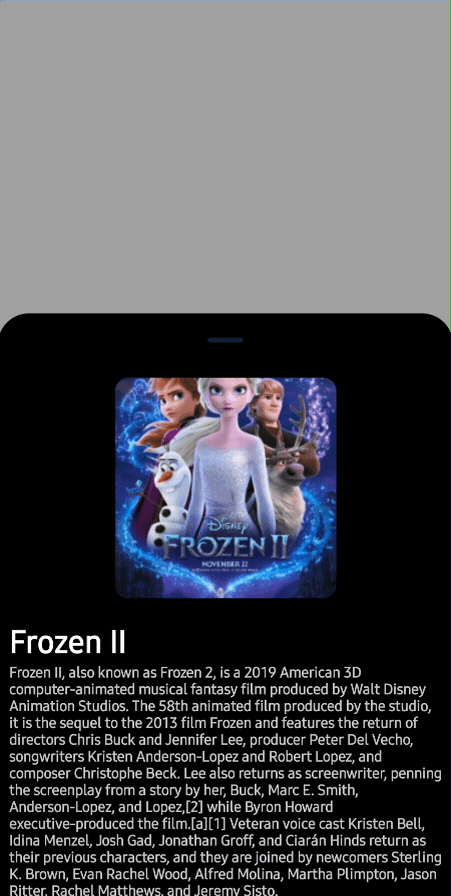


### Nested Scroll

`FlexibleBottomSheet` inherently supports nested scrolling, allowing seamless integration with components like `LazyColumn`, `LazyRow`, and others. However, if you wish to disable nested scrolling, you can achieve this by setting `allowNestedScroll` to `false` within the `rememberFlexibleBottomSheetState`.

```kotlin
FlexibleBottomSheet(
  onDismissRequest = onDismissRequest,
  sheetState = rememberFlexibleBottomSheetState(
    allowNestedScroll = false
  ),
) {
  ..
}
```

You will see the difference below:

Enabled | Disabled |
| :---------------: | :---------------: |
|  |  |

## Find this repository useful? :heart:
Support it by joining __[stargazers](https://github.com/skydoves/FlexibleBottomSheet/stargazers)__ for this repository. :star: <br>
Also, __[follow me](https://github.com/skydoves)__ on GitHub for my next creations! 🤩

# License
```xml
Designed and developed by 2023 skydoves (Jaewoong Eum)

Licensed under the Apache License, Version 2.0 (the "License");
you may not use this file except in compliance with the License.
You may obtain a copy of the License at

   http://www.apache.org/licenses/LICENSE-2.0

Unless required by applicable law or agreed to in writing, software
distributed under the License is distributed on an "AS IS" BASIS,
WITHOUT WARRANTIES OR CONDITIONS OF ANY KIND, either express or implied.
See the License for the specific language governing permissions and
limitations under the License.
```
